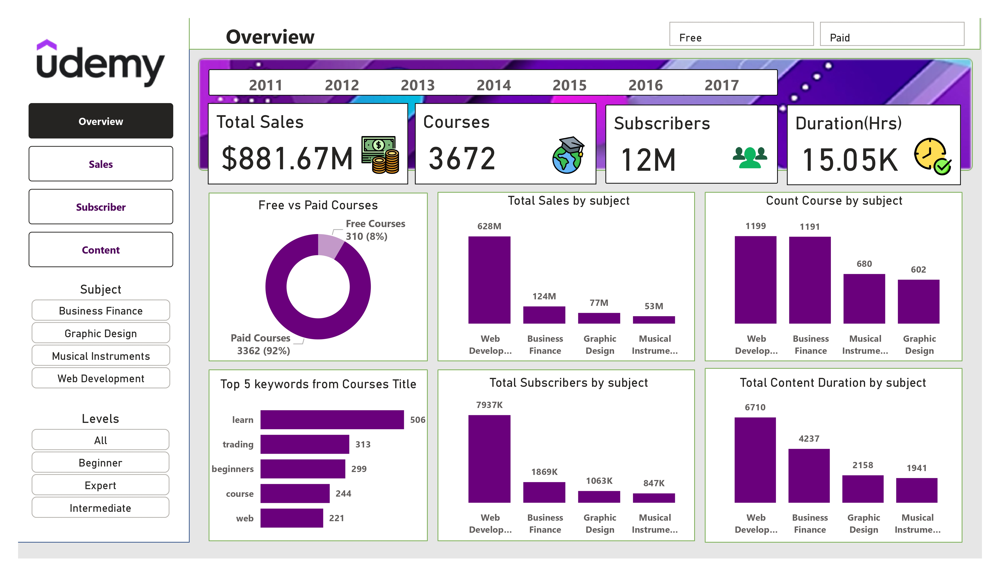
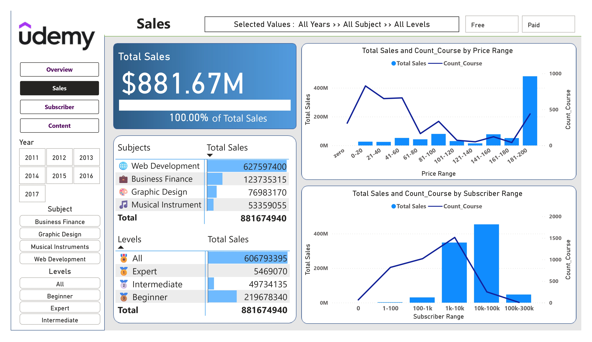
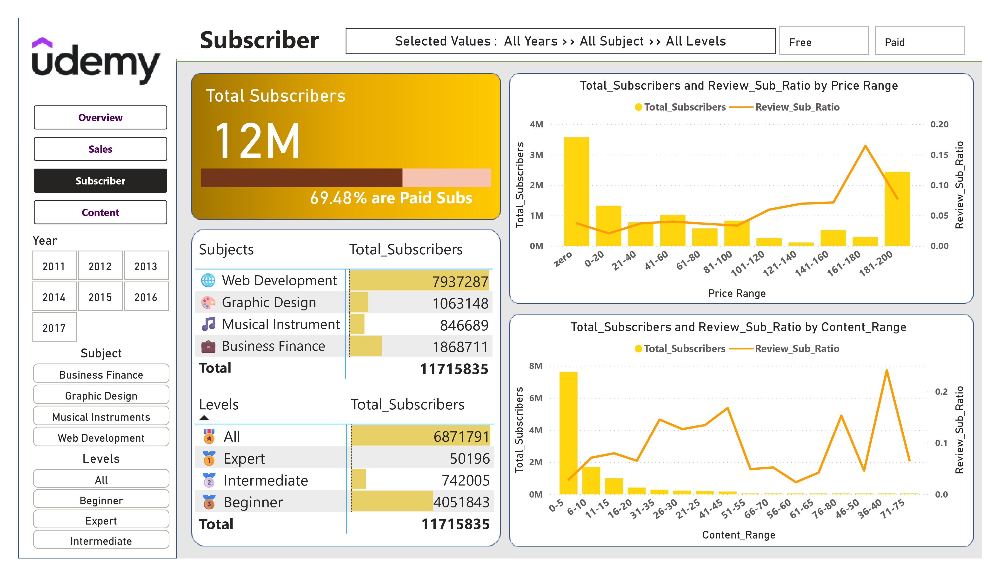
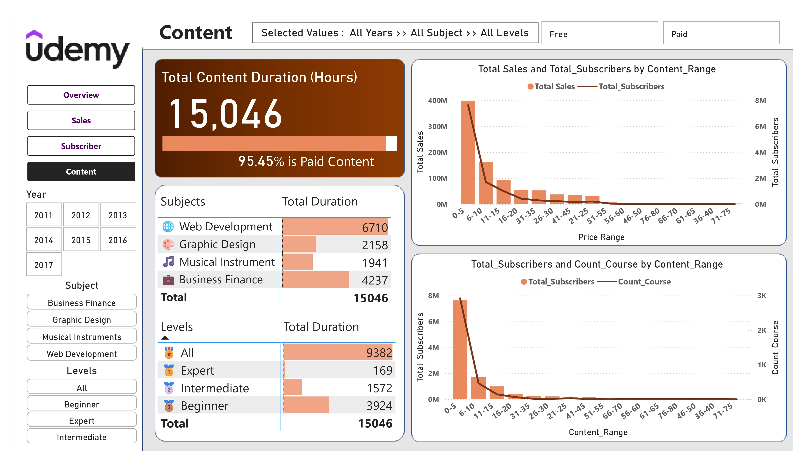

# 📊 Udemy Courses Power BI Dashboard (2011–2017)

An **interactive Power BI dashboard** analyzing Udemy course data from **2011–2017**, designed to explore sales trends, subscriber insights, and content performance across subjects and difficulty levels.

---

## 🚀 Project Overview

This project visualizes Udemy’s course data through **4 analytical dashboard pages** built in **Power BI Desktop**, allowing users to gain deep insights through interactive filters and dynamic measures.

### 📂 Dashboard Pages
1. **📌 Overview** – Key KPIs (Courses, Subscribers, Sales, Duration)
2. **💰 Sales** – Revenue distribution by subject, price range, and level
3. **👥 Subscribers** – Subscriber trends and engagement by price/content range
4. **📚 Content** – Course content duration and level analysis

---

## 🧩 Data Model

- Built on a **clean 9-column dataset**
- Includes **30+ custom DAX measures** for KPIs and trend analysis
- Relationships optimized for slicers and cross-page filtering

---

## 📈 Key Insights

- **Total Courses:** 3,672  
- **Total Sales:** $881.67M  
- **Total Subscribers:** 12M+ (≈69% paid users)  
- **Top Subject:** Web Development – $628M in sales and 7.9M subscribers  
- **Beginner courses** attract the most engagement  
- **Paid content** constitutes 95% of total course duration  

---

## ⚙️ Technical Stack

| Component | Technology Used |
|------------|----------------|
| BI Tool | Microsoft Power BI Desktop |
| Data Processing | Power Query Editor |
| Calculation Layer | DAX (Data Analysis Expressions) |
| Visualization | Interactive charts, slicers, KPIs |
| File Format | `.pbix`, `.xlsx`, `.pdf` |

---

## 🧠 Skills Demonstrated

- Power BI Data Modeling  
- DAX Calculations and Measures  
- Data Cleaning & Transformation  
- Dashboard Design and User Experience  
- Analytical Storytelling  

---

## 🗂️ Files Included

| File Name | Description |
|------------|-------------|
| **Udemy_Data.xlsx** | Cleaned Udemy dataset used for dashboard |
| **Udemy.pbix** | Interactive Power BI dashboard file |
| **Udemy Dashboard.pdf** | Static export / preview of all dashboard pages |
| **README.md** | Project documentation |

---

## 💡 How to Use

1. Open **Udemy.pbix** in Power BI Desktop  
2. Load the **Udemy_Data.xlsx** dataset if prompted  
3. Click **Refresh** to load data  
4. Interact with slicers (Year, Subject, Level, Type) to explore the insights  

---

## 📸 Dashboard Preview

> *(Add screenshots or images here for each dashboard page)*  
> Example:  
>   
> 
> 
> 
---

## 👤 Author

**Pranjal Saxena**  
📧 Email: pranjalsaxena61@gmail.com 
🔗 [LinkedIn](https://www.linkedin.com/in/pranjalsaxena123) | [GitHub](https://github.com/Pranjal-86300) | [Portfolio](https://pranjalsaxena.carrd.co/)

---

⭐ **If you like this project, don’t forget to star this repo!**
